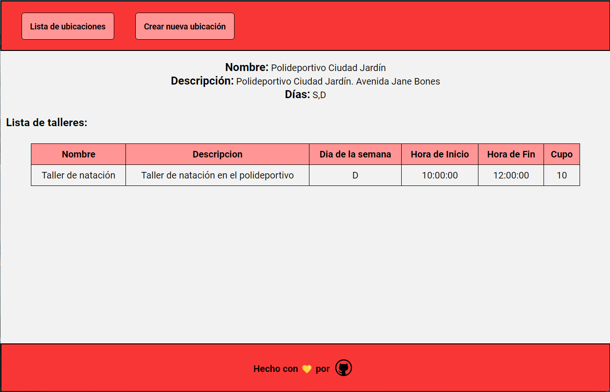

# Proyecto Laravel

## Descripción

Este proyecto es una aplicación web desarrollada con el framework Laravel. La aplicación permite gestionar una base de datos de talleres y ubicaciones. Cada taller tiene una ubicación asociada. La aplicación permite realizar las siguientes operaciones:

-   Listar ubicaciones.
-   Crear ubicaciones.
-   Editar ubicaciones.
-   Eliminar ubicaciones.

## Instalación

-   Crear una base de datos en MySQL con el siguiente nombre:

        respira_laravel

-   php artisan migrate:fresh
-   php artisan db:seed
-   php artisan serve

## Uso/Rutas

-   Pantalla de Bienvenida: [http://127.0.0.1:8000/](http://127.0.0.1:8000/)
-   Listar ubicaciones: [http://127.0.0.1:8000/ubicaciones](http://127.0.0.1:8000/ubicaciones)
-   Detalle de ubicación: [http://127.0.0.1:8000/ubicaciones/2](http://127.0.0.1:8000/ubicaciones/2)
-   Crear ubicaciones: [http://127.0.0.1:8000/ubicaciones/create](http://127.0.0.1:8000/ubicaciones/create)
-   Editar ubicaciones: [http://127.0.0.1:8000/ubicaciones/2/edit](http://127.0.0.1:8000/ubicaciones/2/edit)
-   Eliminar ubicaciones: [http://127.0.0.1:8000/ubicaciones/2/destroyconfirm](http://127.0.0.1:8000/ubicaciones/2/destroyconfirm)

## Imágenes

-   Pantalla de Bienvenida

    

-   Listar ubicaciones

    

-   Detalle de ubicación

    

-   Crear ubicaciones

    

-   Editar ubicaciones

    

-   Eliminar ubicaciones

    

## Tests

-   Crear una base de datos en MySQL con el siguiente nombre:

          respira_laravel_testing

-   php artisan migrate --env=testing
-   php artisan test
-   php artisan test --testsuite=Feature
-   php artisan test --testsuite=Unit

    **Regression Testing**

    Para usar Dusk, es necesario descomentar la siguiente línea en el archivo en C:\\xamp\php\php.ini

    -   ;extension=zip

    Sino dará error al hacer el composer install o update ya que no podrá instalar el paquete de Dusk.

    Instalacion del Driver de Chrome

    -   php artisan dusk:install

    Ejecutar los tests de Dusk

    -   php artisan dusk

## Autor

**Andrés Podadera** - [Perfil Github](https://github.com/andresito87)

## Licencia

The Laravel framework is open-sourced software licensed under the [MIT license](https://opensource.org/licenses/MIT).
